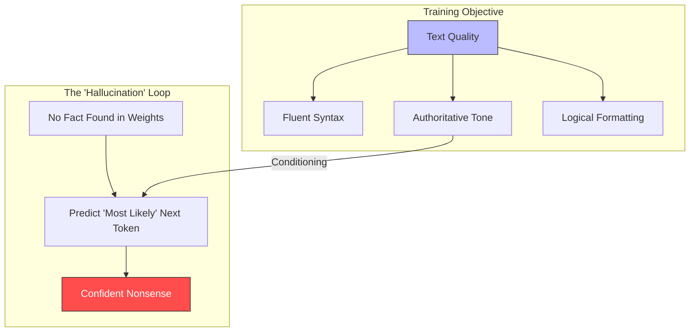
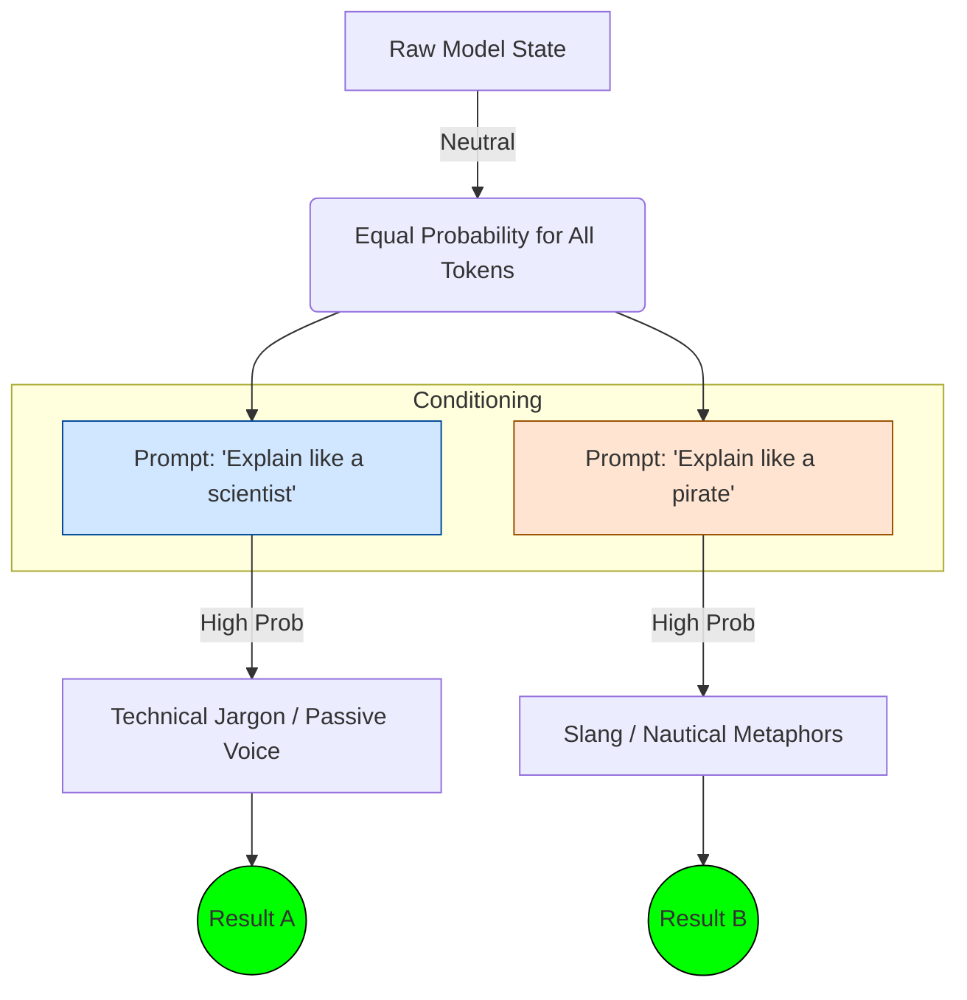
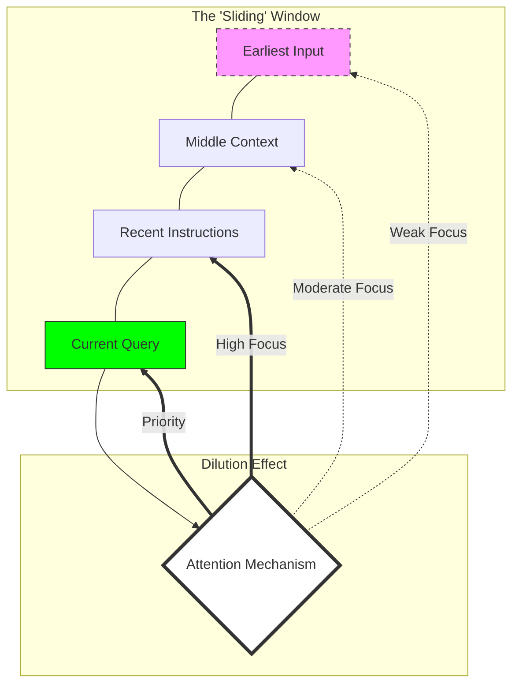

## Purpose

By this point in the series, we’ve covered:

- Why LLMs changed the game  
- How they work internally (at a usable level of detail)  
- How different model families trade off capability, cost, and control  

And yet, for many teams, the lived experience still looks like this:

> *“It worked perfectly yesterday.”*  
> *“Why did it answer confidently but completely wrong?”*  
> *“Why does changing one sentence break the whole thing?”*

This post is about that gap.

The goal here is not to catalog edge cases or failure anecdotes.  
It’s to explain **why these failures are expected**, and why treating LLMs like deterministic software almost always leads to frustration.

---

## These Systems Are Not Executing Logic

Traditional software executes instructions.

Even most classical machine learning systems — classifiers, recommenders, regressors — produce outputs that feel mechanical. Given the same input, you reliably get the same output.

LLMs do not work that way.

An LLM is sampling from a probability distribution over tokens. Even when temperature is set low, the system is still choosing *plausible* continuations, not *correct* ones.

> **Mental model:**  
> An LLM is not retrieving facts or running rules.  
> It is producing the most statistically likely continuation of text given the context provided.

Once you internalize that, many “weird” behaviors stop being surprising.

---

## Confident Nonsense Is a Feature, Not a Bug

One of the most jarring behaviors for new users is how confidently wrong LLMs can be.

They:
- Use authoritative tone  
- Cite plausible-sounding details  
- Follow formatting perfectly  
- Remain calm even when fabricating  

This is not deception. It’s alignment between *style* and *training objective*.

| Feature         | The Goal: Plausibility                             | The Reality: Accuracy                              |
|-----------------|----------------------------------------------------|----------------------------------------------------|
| Training Reward | ""Does this look like a smart person wrote it?""   | ""Is this statement true in the real world?""      |
| Mechanism       | Pattern matching and style replication.            | Fact-checking against a live database.             |
| Outcome         | High Fluency: Perfect grammar, authoritative tone. | Variable Truth: Correct only if the pattern holds. |

During training, models are rewarded for producing text that looks like high-quality human writing — not for checking facts against an external source.

If the training data contains:
- Confident explanations  
- Structured answers  
- Well-formed arguments  

Then confidence becomes part of the learned pattern.

### Why this matters architecturally

You cannot rely on tone or fluency as a proxy for correctness.  
Systems must verify outputs **outside the model**.

This is why retrieval, validation, and constraints show up again and again in production designs.

---

## Prompt Sensitivity Is Structural

Small prompt changes can cause disproportionately large output changes.

This often gets dismissed as “prompt engineering immaturity,” but the deeper reason is simpler:

**Prompts are not instructions. They are conditioning signals.**

A prompt does not tell the model what to do.  
It shifts the probability distribution over what comes next.

Change the wording, and you change:
- Token boundaries  
- Attention patterns  
- Which prior examples the model implicitly activates  

> **Analogy:**  
> Think of prompts less like function calls and more like nudging a crowd’s attention.

This is why:
- Long prompts degrade unpredictably  
- Over-specified instructions sometimes perform worse  
- Examples (“few-shot”) often outperform explicit rules  

---

## Long Context Feels Like Memory — But Isn’t

Large context windows give the *illusion* of memory.

The model can reference things you mentioned earlier, sometimes dozens of pages back. But that doesn’t mean it remembers them in the human sense.

Context is:
- A sliding window  
- Reprocessed on every token  
- Not stored or retrieved later  

As context grows:
- Costs increase  
- Attention becomes diffuse  
- Important details compete with irrelevant ones  

> **Key misconception:**  
> More context does not always mean better answers.

This is why summarization, chunking, and retrieval are architectural necessities — not optimizations.

---

## Generality Hides Unspoken Assumptions

LLMs feel flexible because they’ve seen a little bit of everything.

But that breadth also means they carry:
- Implicit cultural assumptions  
- Averaged conventions  
- Conflicting norms across domains  

When you ask a vague question, the model fills in the blanks using statistical priors — not your intent.

This shows up most clearly when:
- Domain-specific language overlaps with general terms  
- Organizational context is missing  
- Edge cases contradict common patterns  

---

## Why These Failures Keep Reappearing

None of the failure modes above are solved by:
- Bigger models alone  
- Better prompts alone  
- More training data alone  

They are **system-level problems**.

LLMs are powerful components, but fragile foundations.

Treating them like:
- APIs  
- Rule engines  
- Deterministic services  

almost always leads to surprises.

---

## The Architectural Takeaway

If there’s one thing to internalize from this post, it’s this:

> **LLMs must be surrounded by structure.**

That structure typically includes:
- External data sources  
- Validation layers  
- Feedback loops  
- Human-in-the-loop checkpoints  

Not because models are bad — but because they are probabilistic by design.

---

## What’s Next

In the next post, we’ll look at **Retrieval-Augmented Generation (RAG)**.

Not as a buzzword, but as an architectural pattern that:
- Compensates for model weaknesses  
- Shifts reliability boundaries  
- Changes where complexity actually lives  

That’s where theory turns into systems engineering.
