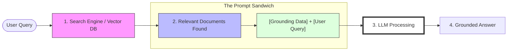

## Purpose

Up to now, this series has focused on understanding **what LLMs are** and **why they behave the way they do**.

If you’ve read the earlier posts, one conclusion should already feel obvious:

> Left on their own, LLMs are powerful but unreliable.

They generate fluent text, but they do not:
- Know what is true *right now*
- Know what is true *for your organization*
- Know which source should be trusted

Retrieval-Augmented Generation (RAG) exists to address exactly that gap.

This post explains:
- Why RAG emerged
- What problem it actually solves
- How it changes system design decisions
- Where teams commonly get it wrong

---

## The Core Problem: Models Don’t Know Your World

LLMs are trained on large, static datasets.

No matter how large the model:
- It does not know your internal documentation
- It does not know your database schemas
- It does not know last week’s policy change
- It does not know which source *you* consider authoritative

When you ask a question that depends on private, recent, or domain-specific knowledge, the model must guess.

And as we saw in Part 4, it will guess **confidently**.

This is not a failure of intelligence.  
It is a mismatch between **where knowledge lives** and **how models generate text**.

---

## What RAG Actually Does

Retrieval-Augmented Generation changes *where the model gets its context*.

Instead of relying solely on its internal parameters a.k.a. parametric knowledge, the system:
1. Retrieves relevant external information
2. Injects that information into the prompt
3. Asks the model to generate an answer grounded in that context

The model is still doing what it always does — predicting the next token.  
But now it’s doing so with **explicit, curated grounding**.

> **Mental model:**  
> RAG doesn’t make the model smarter.  
> It gives the model *better evidence*.

---

## Why Retrieval Works Better Than Fine-Tuning (Most of the Time)

A common early instinct is to fine-tune the model on proprietary data.

Sometimes that’s appropriate. Often, it’s not.

Fine-tuning:
- Bakes knowledge into model weights
- Is expensive to repeat
- Is hard to audit
- Is slow to update

Retrieval:
- Keeps knowledge external
- Allows updates without retraining
- Preserves source attribution
- Makes failures easier to debug

This separation of concerns turns out to be critical.

> **Analogy:**  
> Fine-tuning is like rewriting your application binary every time data changes.  
> Retrieval is like querying a database at runtime without the need for redeployment

Most production systems prefer the latter.

---

## A Concrete Walkthrough

Consider a simple internal Q&A system.

A user asks:
> “What is our data retention policy for customer logs?”

A RAG-based system might:
1. Convert the question into an embedding
2. Search a vector index of internal documents
3. Retrieve the most relevant policy excerpts
4. Inject those excerpts into the prompt
5. Ask the model to answer *using only that context*

The model is no longer inventing policy language.  
It is summarizing and explaining content you already trust.

---

## Retrieval Is an Architectural Choice, Not a Feature

One mistake teams make is treating RAG as a bolt-on enhancement.

In practice, retrieval affects:
- Data pipelines
- Indexing strategies
- Latency budgets
- Failure modes
- Security boundaries

You are no longer just building a “prompt.”  
You are building an **information system**.

Key design questions emerge immediately:
- What data is indexed?
- How often is it refreshed?
- How is access controlled?
- How do we know which source won?

These are not model questions.  
They are classic systems and data engineering questions. These have existed in Search Systems long before Machine Learning was democratized.

---

## Retrieval Quality Matters More Than Model Choice

A surprisingly consistent observation in production systems:

> Better retrieval beats a bigger model.

If retrieved context is:
- Irrelevant
- Outdated
- Too verbose
- Contradictory

then even the best model will struggle.

Conversely, a smaller model with clean, focused context often outperforms a larger one operating blind.

This is why teams spend more time tuning:
- Chunking strategies
- Embedding models
- Ranking heuristics

than swapping LLM vendors.

---

## Common Failure Modes in RAG Systems

RAG does not magically solve reliability. It changes *where failures live*.

Common issues include:
- Retrieving too much context, overwhelming the model
- Retrieving too little, forcing hallucination
- Indexing documents without structure
- Treating embeddings as ground truth rather than heuristics

> **Important:**  
> Retrieval is probabilistic too.  
> You are stacking uncertainty unless you design carefully.

---

## Why RAG Is Becoming the Default Pattern

RAG keeps showing up because it aligns with how organizations already operate.

- Knowledge lives outside models
- Data changes frequently
- Trust varies by source
- Auditing matters

RAG lets models stay general while systems stay specific.

That separation is what makes LLMs usable at scale.

---

## What’s Next

Now that we’ve covered grounding and retrieval, the next post shifts focus to **people and practice**.

In Part 6, we’ll talk about:
- Skills engineers actually need to develop
- Prompting as an interface design problem
- Reliability, security, and failure containment
- Why “prompt engineering” is a misleading term

This is where LLMs stop being a novelty and start becoming part of everyday engineering work.