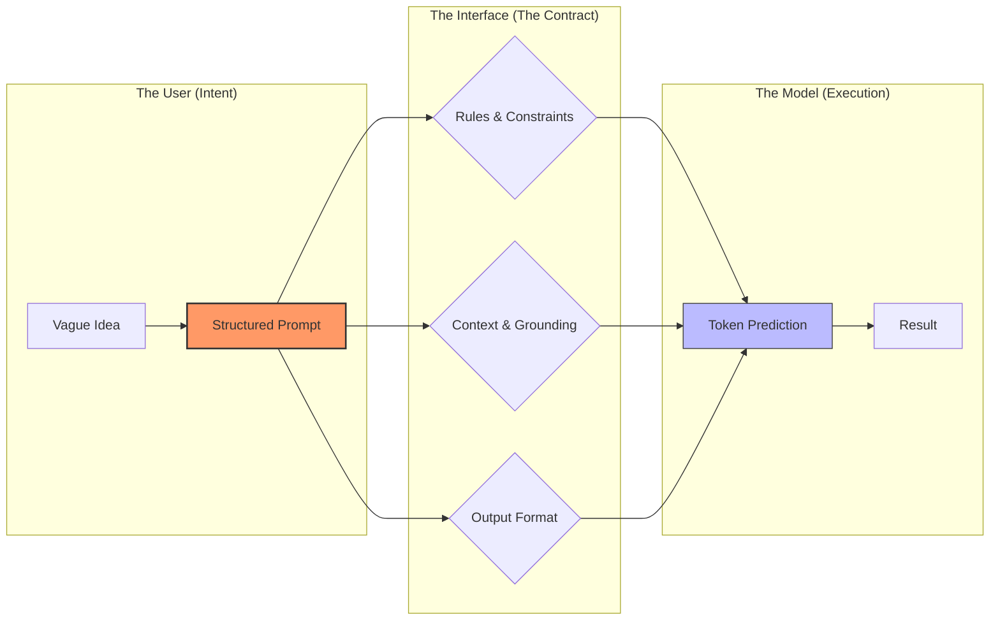
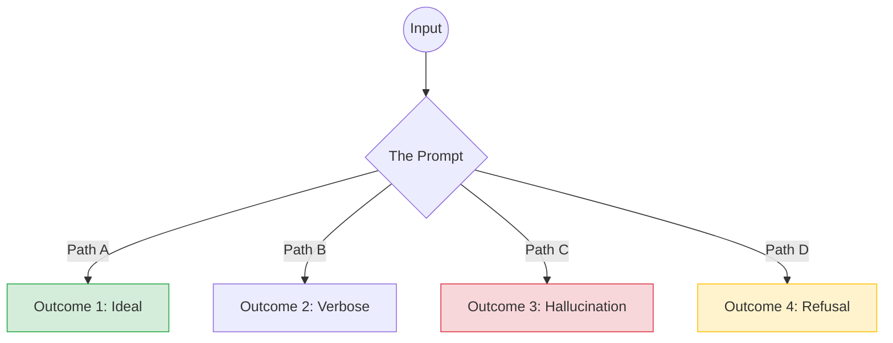
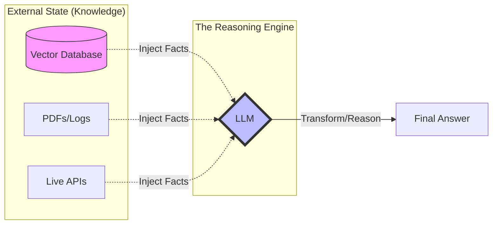
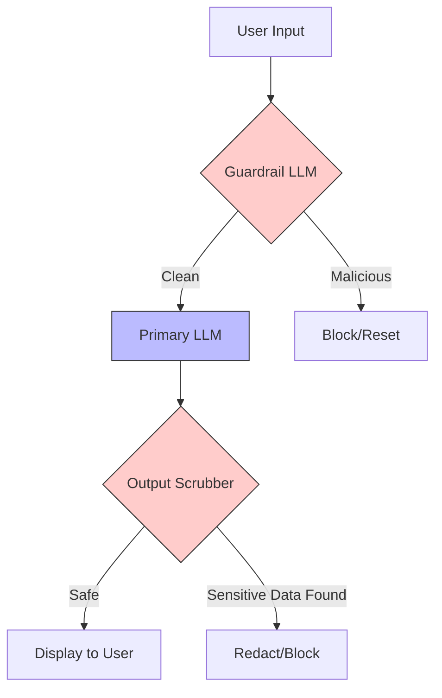

## Purpose

By now, we’ve talked about:
- Why LLMs behave differently from prior ML systems
- Why they fail in predictable ways
- Why architectural patterns like RAG keep emerging

At this point, a common reaction is:

> *“Okay, but what do engineers actually need to learn?”*

The answer is not “prompt engineering” in the narrow sense.

LLMs don’t require a new programming language.  
They require **new engineering instincts**.

This post focuses on the skills that actually transfer to production systems — not tricks, templates, or vendor-specific features.

---

## Prompting Is Interface Design, Not Spellcasting

A useful mental shift is to stop thinking about prompts as magic incantations.

A prompt is an **interface**.

It defines:
- What context the model receives
- What constraints it should respect
- What form the output should take
- What assumptions are left implicit

Poor prompts fail for the same reason poor APIs fail:
- Ambiguous contracts
- Hidden dependencies
- Overloaded responsibilities

> **Key reframing:**  
> Prompt quality is less about clever wording and more about clarity of intent.

Engineers who are good at API design often adapt quickly here.

---

## Reasoning About Probabilistic Systems

Traditional software rewards determinism.

LLMs don’t.

You are no longer asking:
> “Is this code correct?”

You are asking:
> “Is this behavior acceptable across a distribution of outcomes?”

This requires new habits:
- Testing multiple runs, not one
- Evaluating failure *patterns*, not single failures
- Designing guardrails instead of guarantees

This is uncomfortable at first — especially for engineers trained to eliminate nondeterminism.

But it’s essential.

---

## Designing for Failure Up Front

One of the biggest mistakes teams make is treating LLM failures as edge cases.

They are not.

Failures are the **default state** unless you design around them.

That design usually includes:
- Validation of outputs
- Confidence thresholds
- Fallback behavior
- Human review paths

> **Analogy:**  
> You wouldn’t deploy a distributed system without retries and timeouts.  
> LLM-based systems deserve the same treatment.

This is reliability engineering, not AI research.

---

## Separating Knowledge from Reasoning

LLMs are good at reasoning over text.

They are bad at being the source of truth.

Strong systems separate:
- **Knowledge** (databases, documents, policies)
- **Reasoning** (summarization, explanation, transformation)

RAG is one manifestation of this principle, but the idea is broader.

Engineers who already think in terms of:
- Stateless services
- Externalized state
- Clear ownership boundaries

will find this pattern familiar.

---

## Thinking in Systems, Not Models

A recurring theme in this series is that **model choice is rarely the hardest decision**.

What matters more:
- How context is assembled
- How outputs are validated
- How failures propagate
- How users recover from errors

This pushes engineers toward:
- Pipeline thinking
- Observability beyond logs
- Feedback loops with users

> **Important:**  
> Most “LLM problems” turn out to be systems problems wearing new clothes.

---

## Security and Trust Boundaries Change

LLMs collapse boundaries between:
- Input and instruction
- Data and control
- User intent and system behavior

That has security implications.

Engineers now need to think about:
- Prompt injection
- Data exfiltration via generation
- Overly broad context exposure
- Indirect instruction following

This isn’t fundamentally new — it resembles SQL injection and XSS — but the surface area is wider and less explicit.

| Boundary              | Traditional Software             | LLM Systems                           |
|-----------------------|----------------------------------|---------------------------------------|
| Input vs. Instruction | eval() is a known danger.        | Everything is eval().                 |
| Data vs. Control      | SQL Parameters separate data.    | Data can contain ""System"" commands. |
| Trust Boundary        | Hard-coded logic defines limits. | Probability determines behavior.      |

---

## Evaluation Becomes a First-Class Skill

You cannot improve what you cannot measure.

But evaluating LLM systems is harder than measuring:
- Latency
- Error rates
- Throughput

Evaluation often involves:
- Human judgment
- Task-specific criteria
- Qualitative feedback

Teams that succeed tend to:
- Define “good enough” explicitly
- Track regressions over time
- Invest in evaluation infrastructure early

This is closer to product design than pure engineering — and that’s not accidental.

---

## What This Means for Engineering Careers

None of this replaces core engineering skills.

It amplifies them.

Engineers who thrive in LLM-heavy environments tend to be strong at:
- Systems thinking
- API and interface design
- Debugging ambiguous behavior
- Communicating tradeoffs to non-engineers

The models will keep changing.  
These skills will not.

---

## What’s Next

In Part 7, we’ll ground all of this in **day-to-day engineering work**:
- Where LLMs actually help
- Where they slow teams down
- How experienced engineers use them without over-relying on them

This is where theory meets lived experience.
