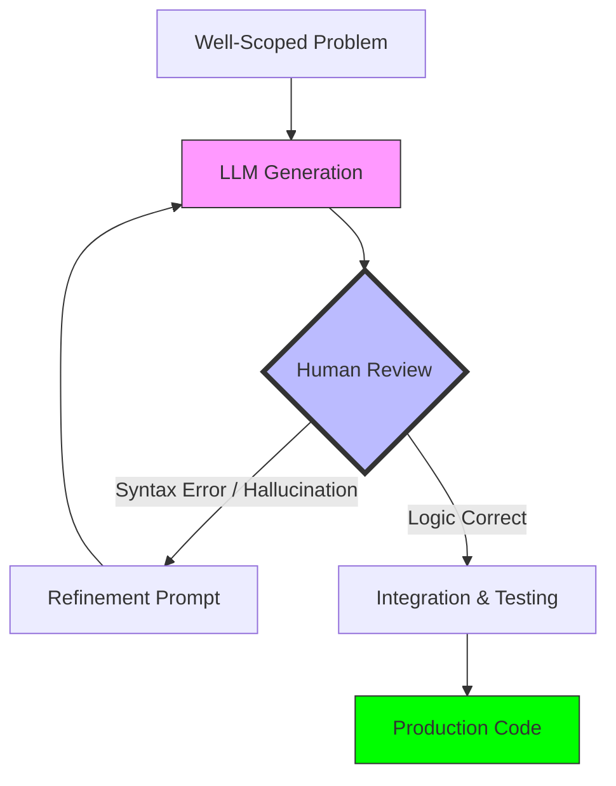
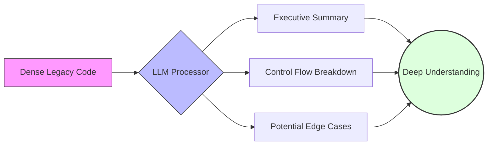
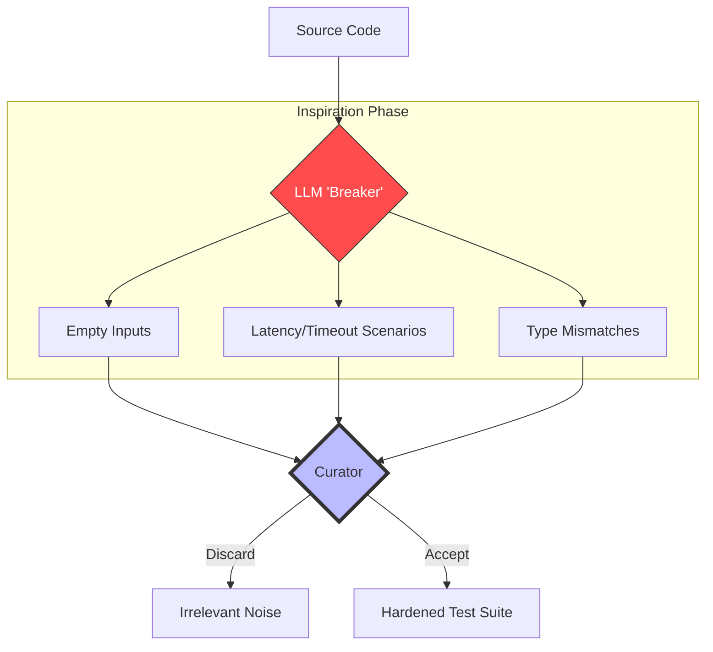

## Purpose

Up to this point, this series has focused on:
- What changed with LLMs
- How they work
- Why they fail
- How systems compensate
- What skills engineers need to adapt

This final post answers the most practical question of all:

> *“How does this actually show up in day-to-day engineering work?”*

Not hypotheticals.  
Not demos.  

Just the places where LLMs genuinely help — and the places where experienced engineers deliberately keep them at arm’s length.

---

## LLMs Are Multipliers, Not Replacements

The most consistent pattern across teams is this:

LLMs don’t replace engineering judgment.  
They **amplify whatever judgment already exists**.

For experienced engineers, that often means:
- Faster iteration
- Better exploration
- Less cognitive overhead on low-leverage tasks

For inexperienced use, it can mean:
- Confidently shipping the wrong thing
- Masking misunderstanding
- Accumulating hidden technical debt

This distinction matters more than any specific use case.

---

## Code Generation: Useful, But Narrowly Scoped

LLMs are surprisingly effective at generating code — within constraints.

They work best when:
- The problem is well-scoped
- The interfaces are known
- The patterns are common
- The output is reviewed, not trusted

Examples where engineers use them productively:
- Writing boilerplate
- Translating between languages or frameworks
- Generating test scaffolding
- Exploring unfamiliar APIs

Where engineers stay cautious:
- Core business logic
- Performance-critical paths
- Security-sensitive code
- Subtle concurrency or correctness issues

> **Mental model:**  
> Treat generated code like a first draft from a junior engineer — helpful, but never authoritative.

---

## Explaining Existing Code (This Is the Quiet Superpower)

One of the most consistently valuable uses of LLMs is **explanation**.

Engineers use LLMs to:
- Summarize unfamiliar codebases
- Explain legacy logic
- Walk through control flow
- Translate dense code into plain language

This is especially powerful when:
- Onboarding to a new team
- Debugging unfamiliar services
- Revisiting old systems with no original context

Unlike generation, explanation reduces risk:
- You still control the final interpretation
- Errors are easier to spot
- Understanding compounds over time

---

## Research, Comparison, and Option Mapping

Another strong use case is **structured exploration**.

Engineers use LLMs to:
- Compare libraries and tools
- Summarize tradeoffs
- Generate decision matrices
- Identify unknown unknowns

The key is that the model is used to **surface options**, not make decisions.

> **Pattern:**  
> LLMs expand the search space.  
> Humans collapse it.

This is particularly useful early in design phases, where breadth matters more than precision.

---

## Test Generation and Edge Case Discovery

LLMs are effective at generating:
- Unit test skeletons
- Input variations
- Boundary cases
- Failure scenarios

They often surface:
- Assumptions baked into code
- Missing validation
- Unhandled edge cases

That said, engineers still:
- Curate the tests
- Decide what matters
- Remove irrelevant cases

The value is in *coverage inspiration*, not correctness guarantees.

---

## Data Analysis and One-Off Queries

For exploratory analysis, LLMs shine.

Engineers and data practitioners use them to:
- Translate questions into SQL
- Explain unfamiliar schemas
- Generate quick summaries
- Prototype transformations

This is especially helpful when:
- The cost of being wrong is low
- Results are manually inspected
- The goal is insight, not automation

LLMs reduce friction — not responsibility.

---

## Where Engineers Avoid Using LLMs

Equally important are the places LLMs are *not* used.

Experienced engineers are cautious about:
- Silent automation
- Decision-making without oversight
- Long-lived logic embedded in prompts
- Systems with unclear failure modes

If a mistake would:
- Breach trust
- Violate policy
- Create cascading failures

then the system usually includes:
- Human review
- Hard constraints
- Or no LLM at all

This restraint is a feature, not a limitation.

---

## The Meta-Shift: How Engineers Think Changes

The biggest change isn’t any single workflow.

It’s how engineers allocate attention.

LLMs shift effort away from:
- Mechanical translation
- Repetitive scaffolding
- Recall-heavy tasks

And toward:
- Problem framing
- System boundaries
- Failure analysis
- Tradeoff communication

In that sense, LLMs don’t make engineering easier — they make **judgment more central**.

---

## Closing Thoughts

Large Language Models are not magic.

They are:
- Probabilistic
- Fallible
- Context-dependent

But when placed thoughtfully into engineering workflows, they reduce friction in places that used to drain energy — without removing the need to think.

The teams that succeed are not the ones who automate the most.  
They are the ones who remain clear about **where automation ends and responsibility begins**.

That clarity, more than any model choice, is what will matter long-term.

---

## End of Series

This concludes **“LLMs and How Our Work Is Changing.”**

If there’s one idea to carry forward, it’s this:

> LLMs don’t change what good engineering is.  
> They change where it shows up.
