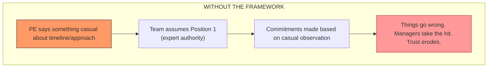
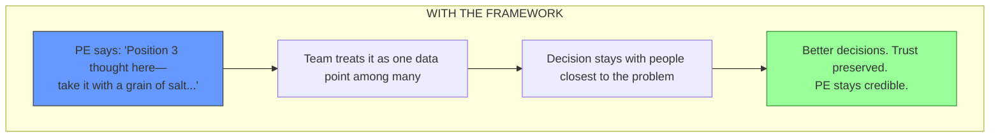

## Why This Post Exists

There's a transition point in a Principal Engineer's career that almost nobody talks about clearly. Not the promotion itself—there's plenty written about how to *get* to PE. What's missing is an honest account of what changes after you arrive, and why the instincts that earned you the role become the very things that prevent you from growing beyond it.

This post is based on a conversation with a Senior Principal Engineer [Luu Tran](https://www.linkedin.com/in/luutran/) who has mentored dozens of PEs through this transition. He's lived through the mistakes, watched others make the same ones, and developed frameworks that actually help. The insights here aren't theoretical career advice. They're lessons extracted from real missteps and hard-won clarity about how influence actually works at the staff-plus level.

If you're a Principal Engineer wondering what "scaling your impact" actually means in practice—or if you're an engineering leader trying to understand why some PEs plateau while others multiply their influence—this is for you.

## The Misconception: Scaling Means Doing More

When Principal Engineers hear "you need to scale your impact," most translate that into an obvious plan: take on more projects, review more designs, mentor more people, attend more meetings. It feels logical. If your impact at the current level came from deep technical contribution and hands-on involvement, then more involvement should produce more impact.

This is not scaling. It is linear accumulation. And it has a hard ceiling.

Consider the math. A typical Principal Engineer (a.k.a. Sr. Staff) has a sphere of influence covering roughly 50 engineers. That's maybe two to three teams, a set of systems you know deeply, and a group of people who see you regularly enough that your judgment carries weight through direct interaction.

When you move to Senior Principal Engineer (a.k.a. Architect), that sphere expands to somewhere between 500 and 5,000 engineers. This is not a 2x increase. It is a 10x to 100x expansion. There are not enough hours in any week to individually influence that many people through code reviews, design consultations, or one-on-one mentoring. 

The Senior PE I spoke with put it directly: "What got you here won't get you there." The transition from Sr. Staff to PE isn't a gradual progression where you get incrementally better at the same activities. It's a step-function change. The nature of the work—technical leadership, architectural thinking, raising the bar—doesn't change dramatically. You don't have to become a fundamentally different person. But the *scale at which you operate* changes completely, and that demands a fundamentally different approach to how you spend your time and where you look for leverage.

**Mental model:** Think of it as the difference between being a gifted individual musician and being a conductor. The skills aren't unrelated—you need deep musical understanding for both. But a conductor who tries to play every instrument simultaneously doesn't produce an orchestra. They produce noise and exhaustion.

## The Megaphone Effect: Your Voice Changed Before You Noticed

Before we talk about frameworks for scaling, there's something more urgent to understand. It's perhaps the most important lesson the Senior PE shared, and it came from a mistake he still regrets.

The moment you're promoted to Principal Engineer, your voice gets an invisible megaphone attached to it. You may not feel different. You may still think of yourself as "just an engineer with opinions." But the organization doesn't see you that way anymore. People will take action based on your words, even when you don't intend them to.

Here's what happened to him. Early in his PE career, he looked at a feature and thought, "That's not so hard." In a meeting, he said something like, "I think we can do that in six months with the people we have." It felt like a casual observation—maybe even helpful context.

But here's what actually followed: product teams made commitments to goals based on that statement. Engineering managers committed their teams to timelines. Engineers started executing against those timelines. And when it turned out to take far longer than six months, the managers—the people who were accountable to their teams and their leadership—took the hit for his mistake. Personally I have lived this experience so many times as I continued growing professionally.

The estimate wasn't just wrong in the usual "estimates are hard" sense. It was wrong because he hadn't considered things that weren't in his domain to estimate. He didn't know the team's *capability*, not just their capacity. He didn't know their competing priorities. He didn't account for the risk of attrition if people were pushed too hard on an aggressive timeline. These are the nuances that engineering managers who are close to their teams understand deeply. And his casual statement—amplified by the megaphone of his title—overrode all of that context in a single sentence.

This matters because the damage isn't abstract. Real managers had to explain to their teams why commitments were being missed. Real engineers felt the pressure of an unrealistic timeline that originated from someone who wouldn't be doing the implementation. The people closest to the work had their judgment implicitly overruled by someone who was speaking from surface-level familiarity, not deep understanding.

The lesson isn't "never estimate" or "never share opinions." The lesson is that the cost of a casual statement from a Principal Engineer is dramatically higher than the cost of the same statement from a senior engineer. Your words have organizational weight whether you intend them to or not. And the worst version of this failure is when you're making pronouncements in areas where you don't have the depth to back them up.

## The 3-Position Framework

So how do you navigate this? How do you know when to speak with authority, when to offer a perspective, and when to stay quiet? The Senior PE learned a framework—originally attributed to Reid Hoffman—that has become central to how he operates. It's deceptively simple, but it changes how people receive and act on what you say.

The idea: every time you speak from a position of influence, you're implicitly operating from one of three positions. The problem is that most PEs never make this explicit, and the default assumption from listeners is always that you're speaking from Position 1.

### Position 1: The Expert Voice

This is the position where you're saying, "I'm the expert here. I've thought through this deeply. This is my considered technical judgment, and I'm putting my credibility behind it."

For Principal Engineers, the default assumption when you open your mouth is that you're coming from Position 1. People hear your title, they hear your statement, and they treat it as authoritative guidance. That's the megaphone effect in action.

**You should actually be speaking from Position 1 about 5% of the time.** Maybe less. This position is reserved for situations where you have genuine, deep expertise in the area. Where you've thought through the alternatives. Where the decision has been vetted through structured mechanisms—architecture reviews, technical decision documents, formal debates with peers. Where the decision is consequential enough and within your domain enough that it warrants the full weight of your authority.

An example: structured technical decisions that have gone through proper review and debate within the PE community. These aren't casual opinions—they're genuine technical positions that have been vetted, challenged, and refined. When those decisions are communicated, they carry Position 1 authority because the process has earned it.

If you're using Position 1 for everything you say, you're overstepping your expertise, making people afraid to push back, and setting yourself up for exactly the kind of six-month-estimate failure described above.

### Position 2: The Experienced Advisor

This is the middle ground, roughly 10% of your communication. In Position 2, you're saying, "I've seen situations like this before. I have a perspective worth considering. But you're closer to this problem than I am, you've spent more time with the details, and if you disagree, I genuinely want to hear why."

Position 2 opens the door for dialogue. It makes it safe for people to push back. It adds value through experience and pattern recognition without shutting down the people who are actually doing the work.

The Senior PE gave an example of this working well. He initially pushed back on a technical decision from Position 2—he was skeptical and wanted the team to think it through more carefully. After discussion and debate, the core decision turned out to be sound. People disagreed with some edge cases around it, but the foundation held. When he asked, "Are you telling me I should reverse this decision?" the answer was no. The decision stood, but the conversation refined it.

That's Position 2 working as intended. You're contributing genuine value from your experience. You're pressure-testing the team's thinking. But you're not creating a dynamic where your word is final simply because you're the most senior person in the room.

### Position 3: The Layperson's Perspective

This is where you spend the vast majority of your time—roughly 85% percent. In Position 3, you're saying, "I don't have deep expertise here. As a layperson, or maybe as a potential customer of this feature, here's a thought. It's worth about two cents. It's just another data point."

And honestly, much of the time when you're in Position 3, the best thing to do is stay quiet. The team has people who actually know what they're doing. They have data. They have context you don't have. Another casual opinion from a senior person isn't going to help—and it might actively hurt if the megaphone effect turns your two cents into a mandate.

The Senior PE shared a story that illustrates how to handle Position 3 well. A senior leader asked him point-blank what he really thought about the AI models their organization was using. His initial response was exactly right: "It's not my place to say. I'm not a scientist. I can't tell you whether I agree or disagree with the approach, but I'm going to commit to making it work for all of us."

The leader pressed. Hard. And eventually, the Senior PE shared his concerns—the accuracy issues, the instruction-following problems, all the things that worried him. But he made sure to say: "Please don't make decisions based on this alone." And the leader didn't. He triangulated with distinguished scientists and engineers, seeking diverse feedback before making consequential decisions. The PE's input was one data point among many, weighted appropriately because both parties understood it was a Position 3 perspective.

### Why Making This Explicit Changes Everything

Here's the transformation this framework enables:

The problem isn't that PEs have opinions outside their expertise — everyone does. The problem occurs when you speak from Position 3 but people assume you're speaking from Position 1. That's when teams make commitments based on your casual observations. That's when estimates get baked into roadmaps even though you were spitballing. That's when managers who are accountable for the outcome get hurt by a statement you forgot you even made.

By explicitly calling out which position you're speaking from, you prevent that misunderstanding. You make it safe for people to weight your input appropriately. And perhaps most importantly, you protect your own credibility. A PE who is known for caveating their input honestly—who says "I don't have the depth here to give you a reliable answer" when that's true—earns *more* trust over time, not less. The PE who speaks with authority about everything eventually gets things wrong enough that people stop trusting anything they say.

## What This Mental Model Demands of You

If you accept that scaling is a step-function change and that your voice carries outsized weight, several practical consequences follow.

**First, you need to audit how you're spending your time.** If most of your week is spent on activities that scale linearly with your effort—individual code reviews, one-off design consultations, debugging specific production issues—you're operating at the wrong level of leverage. These activities made you a great PE. They won't make you an effective Senior PE. You need to find 5x and 10x opportunities: mechanisms that multiply your impact across hundreds of engineers rather than benefiting one team at a time. (This is the subject of the next post in this series.)

**Second, you need to develop the habit of position-labeling.** Before you offer an opinion in any meeting, mentally ask yourself: is this Position 1, 2, or 3? If it's Position 3, either stay quiet or explicitly caveat it. If it's Position 2, invite disagreement. Reserve Position 1 for the 5% of situations where you've genuinely earned the authority to be definitive. This is a practice, not a one-time decision. It requires conscious effort until it becomes instinct.

**Third, you need to build leverage through relationships, mechanisms, and artifacts—not just through direct technical contribution.** The Senior PE I spoke with described borrowing "superpowers" from managers (who multiply impact through organizational systems) and Technical Program Managers (who create mechanisms to coordinate work without positional authority). As a PE, you have neither direct reports nor organizational leverage in the traditional sense. What you have is technical trust and the ability to create systems—review processes, decision frameworks, knowledge-sharing forums—that carry your judgment into contexts you'll never personally be in. We briefly touched on this in our `Building Influence` post and we'll explore this in depth in the next post.

**Fourth, accept that this transition is uncomfortable.** The Senior PE was remarkably candid about the discomfort. He didn't seek the spotlight. He described himself as someone who runs away from visibility, not toward it. But the role requires a kind of visibility and influence that doesn't come naturally to most people who built their careers on deep technical work. The math of the scope change doesn't leave room for staying comfortable. The question isn't whether you're comfortable with it. The question is whether you're willing to be uncomfortable in service of the impact you can have.

## The Real Shift

Scaling as a Principal Engineer is not about doing more. It is about changing the nature of what you do.

The step-function mental model matters because it prevents you from optimizing the wrong thing. If you think the path to Senior PE is "be a better PE," you'll work harder, take on more, and eventually burn out without meaningfully expanding your impact. The engineers in your immediate orbit will benefit, but the 500 or 5,000 engineers you need to influence will never feel your presence.

The 3-Position Framework matters because it solves the most dangerous failure mode at this level: the gap between the weight your words carry and the depth behind them. The megaphone doesn't care whether you intended to be authoritative. It amplifies everything equally. The only defense is to explicitly calibrate how people should receive what you're saying—and to have the discipline to stay quiet when the honest answer is "I don't have the depth here."

If there's one takeaway from this post, it's this: the PE who scales effectively is not the one who becomes the best individual contributor in a larger room. It's the one who recognizes that the room changed, the rules changed, and the leverage points changed—and rebuilds their operating model accordingly.

The next post in this series covers the operational side of this shift: how to borrow leverage from other disciplines, create mechanisms that carry your influence without your presence, and scale your knowledge through writing and artifacts.
